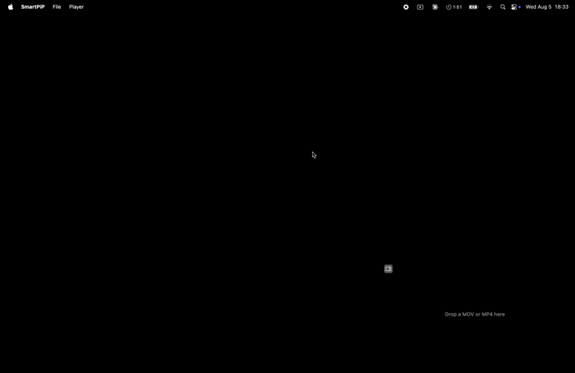
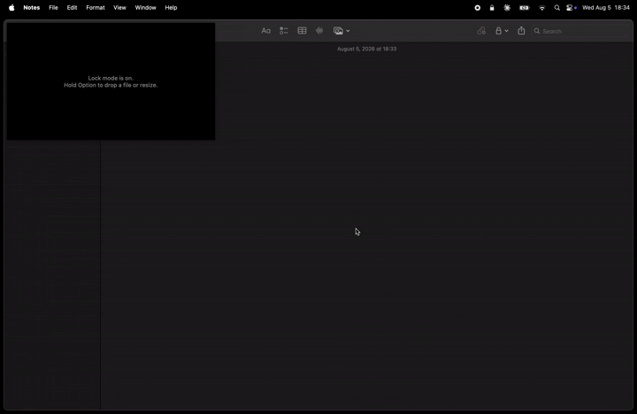
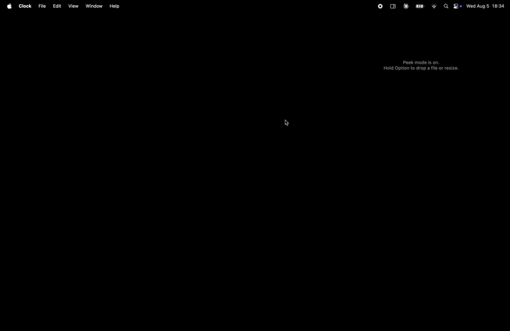
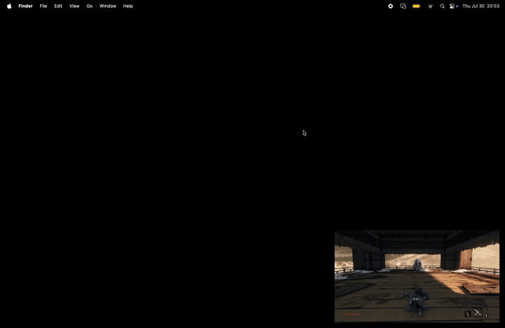
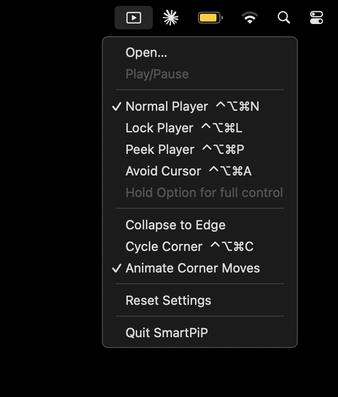

# SmartPiP

A small always-on-top video player for macOS that gets out of your way. It plays local MOV
and MP4 files in a borderless window that sits in a screen corner, and it can dodge your
cursor, tuck itself against the screen edge, or go click-through so the app underneath keeps
working. Zero dependencies: everything it uses ships with macOS.

## Modes

One choice with four options, in the Player menu and the menu bar item. Exactly one is
selected at all times.

| Mode | Shortcut | What it does |
| --- | --- | --- |
| Normal Player | `⌃⌥⌘N` | An ordinary player, and the only one you interact with directly. The default. |
| Lock Player | `⌃⌥⌘L` | Click-through. Fades while the cursor rests on it. |
| Peek Player | `⌃⌥⌘P` | Tucks against the nearest side edge when the cursor arrives, slides back when it leaves. |
| Avoid Cursor | `⌃⌥⌘A` | Moves up or down to the other corner on its side as the cursor gets close. |

**Hold Option to take the player back.** For as long as the key is down, Lock, Peek and
Avoid all behave like a normal player: the transport controls appear, the window can be
dragged and resized, and clicks land on it instead of passing through. Nothing moves on its
own while you hold it. Let go and the mode carries on.

### Normal Player

The only mode with transport controls, and the only one you can drop a file onto, resize,
drag, or collapse yourself. Dragging only picks a corner: let go anywhere and the player
parks in the corner for that quarter of the screen. macOS never tiles it against an edge.

**Collapse to Edge** sends the player off the nearest side edge, leaving a small tab you
click to bring it back. Use the small grey button in the player's top left corner, or either
menu. It moves on a click and at no other time. Normal Player only, and your choice is kept
between launches: switching to another mode brings the player back out first, and holding
Option does not lend this one out.



### Lock Player

Clicks, scrolls and hovers pass straight through to whatever is underneath, and resting the
cursor on the player fades it well down so you can read through it. The menu bar item stays
clickable.



### Peek Player

The player tucks itself against the nearest side edge when your cursor reaches it, leaving
the same tab a collapsed player leaves, and slides back out a moment after the cursor has
gone. Going is immediate; coming back waits, so crossing its corner on the way past does not
make it spring out at you.



### Avoid Cursor

As the cursor gets close, the player moves straight up or straight down, to the corner at
the other end of the side it is already on. A player on the right stays on the right, and
one on the left stays on the left, so it never crosses the middle of the screen. It stays
where it lands.



## Requirements

macOS 14 Sonoma or later. You need either Xcode 15 or later, or just the Command Line Tools
(`xcode-select --install`), plus a local `.mov` or `.mp4` to play. There is nothing to
install, no packages to resolve and no accounts to create.

Apple silicon and Intel both work, but `Scripts/build-cli.sh` compiles for the machine it
runs on. Use `lipo` or the Xcode project if you need one binary for both.

## Running

```bash
git clone https://github.com/rvnztolentino/smartpip.git && cd smartpip
```

With Xcode, open `SmartPiP.xcodeproj` and press ⌘R. With only the Command Line Tools:

```bash
Scripts/build-cli.sh && open build/SmartPiP.app
```

Pass `release` for an optimised build. The script rebuilds from scratch every run, so rerun
it after any source change. Output goes to `build/`, which is gitignored. To watch log
output, run the binary directly instead of using `open`:

```bash
build/SmartPiP.app/Contents/MacOS/SmartPiP
```

Open a file with ⌘O or by dropping it on the player. Quit with ⌘Q.

Clicking the player never brings SmartPiP to the front, so ⌘O, ⌘Q and the space bar only
reach it while SmartPiP is already the active app. Click its Dock icon first, or use the
menu bar item, which works whatever is in front.

## Shortcuts and menus

| Shortcut | Action |
| --- | --- |
| `⌃⌥⌘N` `⌃⌥⌘L` `⌃⌥⌘P` `⌃⌥⌘A` | Select a mode |
| `⌃⌥⌘C` | Move to the next corner |
| `⌥` held | Take the player back for as long as you hold it |

Option has to be held on its own, since every shortcut above already contains it.

The menus carry the rest: Open…, Play/Pause, Collapse to Edge, Cycle Corner, Animate Corner
Moves and Reset Settings. The menu bar item is worth knowing about, because it keeps working
when the player does not: a locked player cannot be clicked at all, and a collapsed or
peeking one is only a tab.



If a shortcut silently does nothing, another app has already claimed it. Console shows a
line like `SmartPiP: could not register ⌃⌥⌘L`. Change the matching entry in
[`HotKeyCenter.swift`](SmartPiP/Input/HotKeyCenter.swift).

## Settings

No environment variables, no keys, no services and no privacy permissions. The app asks for
nothing before it runs.

The player remembers its corner, mode, size and whether you collapsed it, written the moment
they change rather than at quit, so a Force Quit loses nothing. A peeking player tucking
itself away is not remembered, because that is the cursor rather than you.

Reset Settings, at the foot of both menus, puts everything back to bottom right, Normal
Player, 480x270, out from the edge. The same thing from the shell, with the app closed:

```bash
defaults delete com.rvnztolentino.SmartPiP
```

Quit while locked and the player relaunches locked, click-through from the moment it
appears. Quit while collapsed and it relaunches as a tab. Peek always relaunches out, and
tucks itself away again only once your cursor arrives.

## Notes

- Local `.mov` and `.mp4` only. No streaming, no MKV, no third-party playback engine.
- Four corner positions and nothing else, flush against `NSScreen.visibleFrame`, so the menu
  bar and the Dock are respected. A collapsed player rests beside the corner it came from.
- Lock, Peek and Avoid refuse dropped files and resizes outright rather than working only if
  you are quick. Each says so on the player, and each points at the Option hold.
- A collapsed player cannot be dragged or resized in any mode. Bring it out first.
- Resizing keeps the video's proportions. How big is remembered, what shape is not: an empty
  player is always 16:9.
- The app ships no icon of its own, so macOS gives it the default one.
- Builds are sandboxed and run under the hardened runtime, but they are ad hoc signed rather
  than notarised. That is fine locally, where nothing is quarantined, but Gatekeeper would
  object if you sent the app to someone else.

## Tech stack

Swift 5 and AppKit, with no third-party packages.

- `AVPlayer` inside an `AVPlayerView`, for the native transport controls and hardware decode
  through VideoToolbox
- Carbon `RegisterEventHotKey` for the global shortcuts, which needs no permission prompt
- A non-activating `NSPanel`, so a click on the player never steals focus from your work
- `NSEvent.modifierFlags`, polled on the same timer as the cursor, for the Option hold. A
  global event monitor would want the Input Monitoring permission for the same answer
- The window is moved by hand rather than by `performDrag(with:)`, whose drag loop offers to
  tile a window that reaches a screen edge
- `UserDefaults` for the remembered corner, mode, size and collapse
